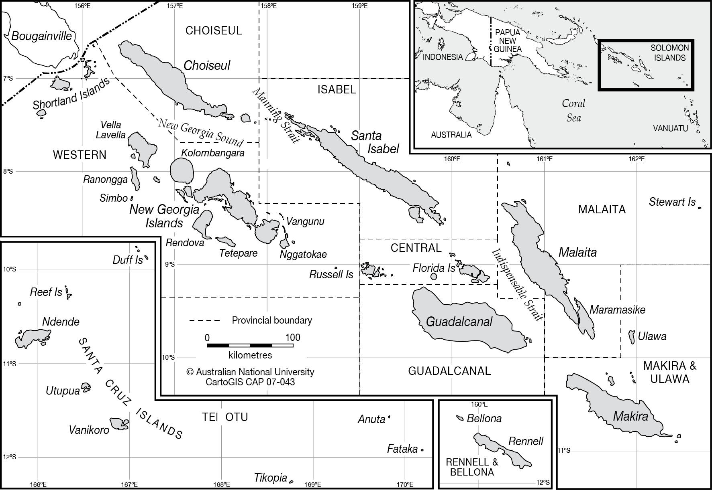
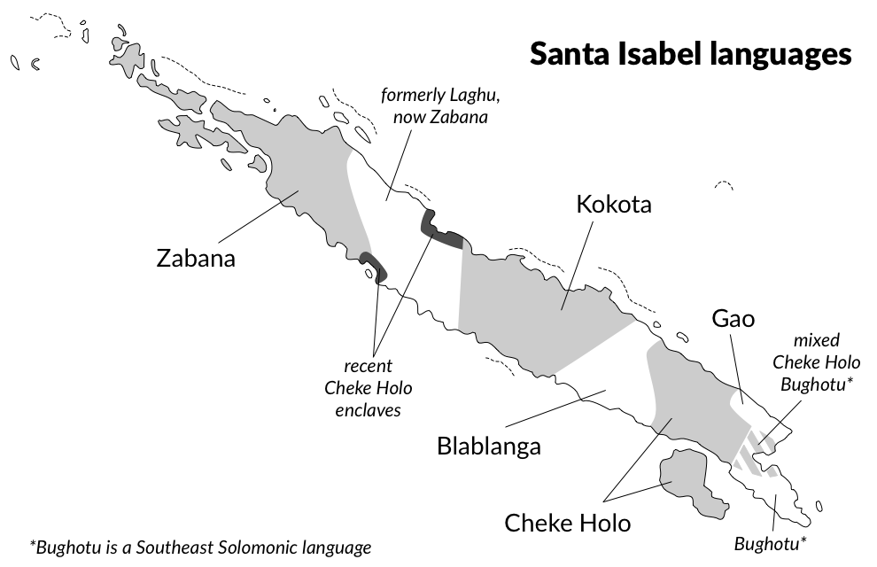
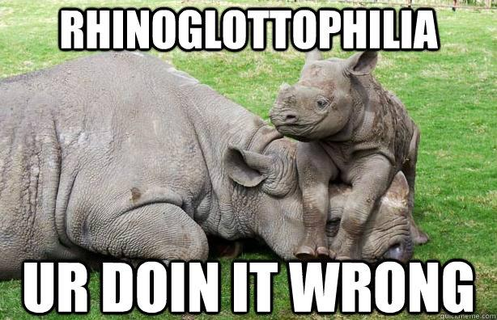
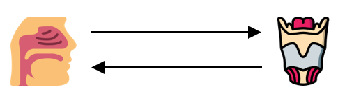

```{r setup, include=FALSE}
knitr::opts_chunk$set(echo = FALSE, message = FALSE)
knitr::opts_knit$set(root.dir = here::here())
options(htmltools.dir.version = FALSE)
library(tidyverse)
theme_set(theme_minimal())
options(
  ggplot2.discrete.fill = c("#a6611a", "#018571", "#264653", "#2a9d8f", "#a8dadc", "#457b9d", "#e76f51")
)
library(xaringanExtra)
use_xaringan_extra(c("panelset", "tachyons"))
```

background-image: url("maggie-hung-5biCgPHSJaQ-unsplash.jpg")
background-size: cover

---

class: inverse bg-black middle center

# .small-caps[language context]

---

# Solomon Islands

.center[

]
---
class: center middle



---

# Cheke Holo


---

class: inverse bg-black middle center

# .small-caps[nominalisation]

---

# Nominalisation

| Pattern | Verb              |                       | Noun          |                         |
|---------|-------------------|-----------------------|---------------|-------------------------|
| I       | p-, t-, k-        | /pore/ 'to comb'      | pʰ-, tʰ-, kʰ- | /pʰore/ 'comb'      |
| II      | r-, l-            | /lehe/ 'to die'       | gr-, gl-      | /glehe/ 'death'      |
| III     | ɣ-                | /ɣor̥a/ 'to paddle'   | g-            | /gor̥a/ 'paddle'     |
| IV      | h-                | /haru/ 'to tie'       | n̥-           | /n̥aru/ 'knot'     |
| V       | D-, N-, /ʔ/-, CC- | /dafi/ 'to be bright' | /na/-         | /nadafi/ 'sun'   |
|         |                   | /moia/ 'to be dry'    |               | /namoia/ 'reef'     |
|         |                   | /ʔugra/ 'to fish'     |               | /naʔugra/ 'fishing' |
|         |                   | /fnera/ 'to wound'    |               | /nafnera/ 'wound'   |

---

# Once source or many?

**Tryon & Hackman (1983)**

* Only mention Pattern I and II.

* Pattern I: .dark-green[**obscure morphological process**].

* Pattern II: .dark-green[**POc \*ga- '.small-caps[instr]'**].

--

**White et al. (1988) and White (1995)**

* Discuss all five patterns.

* .dark-green[**Analysed as morphological processes**].


---
class: inverse bottom right
background-image: url("key-hole.jpg")

# Pattern V is the key

# /dafi/ ~ /na-dafi/


---

# POc \*_na_

.bg-washed-blue.b--blue.ba.bw2.br3.shadow-5.ph4.mt2[
POc \*_na_ is a **determiner** (Lynch et al. 2011:70–72, Blevins & Kaufman 2012).
]

--

.bg-washed-blue.b--blue.ba.bw2.br3.shadow-5.ph4.mt2[
- It marks a NP as **definite**.
- Mostly with non-human entities.
]

--

.bg-washed-blue.b--blue.ba.bw2.br3.shadow-5.ph4.mt2[
**Reflexes** can be found in several oceanic languages.

In Santa Isabel languages:

- Zabana _na_-.
- Kokota _-na_.
- Blablanga _-na_.

]

---
class: inverse bg-black middle center

# .small-caps[diachrony]

---

# Where does it come from?

.panelset[

.panel[.panel-name[Pattern V]
.bg-washed-green.b--green.ba.bw2.br3.shadow-5.ph4.mt2[
/dafi/ 'to be bright' > /nadafi/ 'sun'
]

➤ Retention of POc definite article.

➤ Determiner > Nominaliser.
]


.panel[.panel-name[Pattern IV]
.bg-washed-green.b--green.ba.bw2.br3.shadow-5.ph4.mt2[
/naru/ 'to tie' > /n̥aru/ 'knot'
]

➤ Historical change \*H(V)R and \*R(V)H > R̥ in Cheke Holo.

.bg-washed-blue.b--blue.ba.bw2.br3.shadow-5.ph4.mt2[
PSIs \*_namaha_ > Z _namaha_, CH /nam̥a/ 'love'

PCH \*_na-haru_ > \*_nharu_ > /n̥aru/ 'knot'
]
]

.panel[.panel-name[Pattern III]
.bg-washed-green.b--green.ba.bw2.br3.shadow-5.ph4.mt2[
/ɣor̥a/ 'to paddle' > /gor̥a/ 'paddle'
]

➤ Fortition, loss of pre-nasalisation

.bg-washed-blue.b--blue.ba.bw2.br3.shadow-5.ph4.mt2[
PCH \*_na-ɣorha_ > CH \*_nɣorha_ > \*_ⁿgorha_ > /gor̥a/ 'paddle'
]

➤ Loss of pre-nasalisation in Bughotu (Ivens 1933)

]

.panel[.panel-name[Pattern II]
.bg-washed-green.b--green.ba.bw2.br3.shadow-5.ph4.mt2[
/lehe/ 'to die' > /glehe/ 'death'
]

➤ Excrescent stop, loss of pre-nasalisation.

.bg-washed-blue.b--blue.ba.bw2.br3.shadow-5.ph4.mt2[
PCH \*_na-lehe_ > \*_nlehe_ > \*_ⁿglehe_ > /glehe/ 'death'
]

➤ Place lenition to nasal glide (placeless) N/[ŋ] (Ohala & Lorentz 1977, Howe 2004).

➤ Velarised liquids (Recasens 2011).

]

.panel[.panel-name[Pattern I]

.bg-washed-green.b--green.ba.bw2.br3.shadow-5.ph4.mt2[
/pore/ 'to comb' > /pʰore/ 'comb'
]

.center[

]

]

]

---
class: center middle




---

# Rhinoglottophilia

.center[

]

&nbsp;

.f2[*The mysterious connection between nasality and glottality*]

— Matisoff 1975

---

# From the larynx to the nasal cavity (H > N)

&nbsp;

.bg-washed-blue.b--blue.ba.bw2.br3.shadow-5.ph4.mt2[
➤ **Laryngeal consonants nasalise vowels**

English, Thai and Lao (Tai-Kadai), Lahu, Lisu, Hayu, Arakanese (Sino-Tibetan), East Gurage (Semitic), Ponapeic (Oceanic), Bantu.
]

.bg-washed-blue.b--blue.ba.bw2.br3.shadow-5.ph4.mt2[
➤ **Laryngeal consonants don't block nasal spreading**

South American languages.
]

---

# From the nasal cavity to the larynx (N > H)

.bg-washed-blue.b--blue.ba.bw2.br3.shadow-5.ph4.mt2[
➤ **Nasal consonants develop into aspiration**
]

.bg-washed-blue.b--blue.ba.bw2.br3.shadow-5.ph4.mt2[
Tai-Kadai (Matisoff 1975), Basque (Igartua 2011, 2015, Egurtzegi 2018), New Caledonian (Blevins & Garrett 1993).
]

.bg-washed-blue.b--blue.ba.bw2.br3.shadow-5.ph4.mt2[
Owerri (Blevins & Garrett 1993): \*CVNV > \*CNV > CⁿṼ > CʰṼ

Algonquian (Blevins & Garrett 1993): \*NC > hC

Old Tibetan (Jacques 2011, Hill 2007): NC > Cʰ

]

---

# Nominalisation: Pattern I .f2[*Take 2*]


.bg-washed-green.b--green.ba.bw2.br3.shadow-5.ph4.mt2[
/pore/ 'to comb'> /pʰore/ '(the) comb'
]

--

&nbsp;

.bg-washed-blue.b--blue.ba.bw2.br3.shadow-5.ph4.mt2[

➤ **From nasalisation to aspiration**

\*naC > \*nC > \*N̥C > Cʰ
]

.bg-washed-blue.b--blue.ba.bw2.br3.shadow-5.ph4.mt2[
PCH \*_na-pore_  > \*_npore_ > \*_N̥pore_ > \*_ʰpore_ > /pʰore/ 'comb'
]

---
class: inverse middle right

# What are the .blue[processes] behind rhinoglottophilia?

---

# Ideas?

&nbsp;

* Carignan (Chris) 2017, 2018.

  * Covariation of nasalization, tongue height, and breathiness.

* Delay of glottal spreading gesture?

* What else?

&nbsp;

<span style="font-family:Junicode;">.center[.f2[**HIC SVNT LEONES**]]</span>

---

# Credits

Ocean Photo by <a href="https://unsplash.com/@maggie__1105?utm_source=unsplash&utm_medium=referral&utm_content=creditCopyText">maggie hung</a> on <a href="https://unsplash.com/s/photos/pacific-ocean?utm_source=unsplash&utm_medium=referral&utm_content=creditCopyText">Unsplash</a>

Keyhole Photo by <a href="https://unsplash.com/@deleece?utm_source=unsplash&utm_medium=referral&utm_content=creditCopyText">Deleece Cook</a> on <a href="https://unsplash.com/s/photos/key?utm_source=unsplash&utm_medium=referral&utm_content=creditCopyText">Unsplash</a>


<div>Icons made by <a href="https://www.flaticon.com/authors/smashicons" title="Smashicons">Smashicons</a> from <a href="https://www.flaticon.com/" title="Flaticon">www.flaticon.com</a></div>